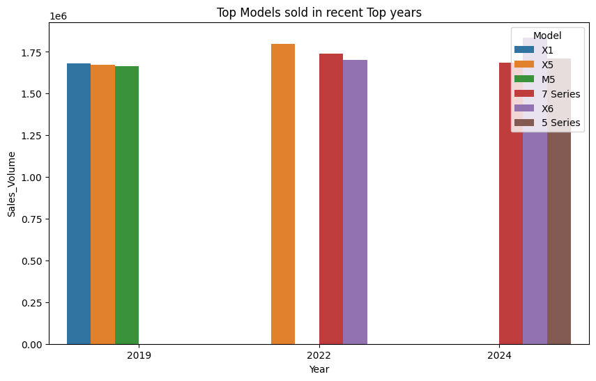
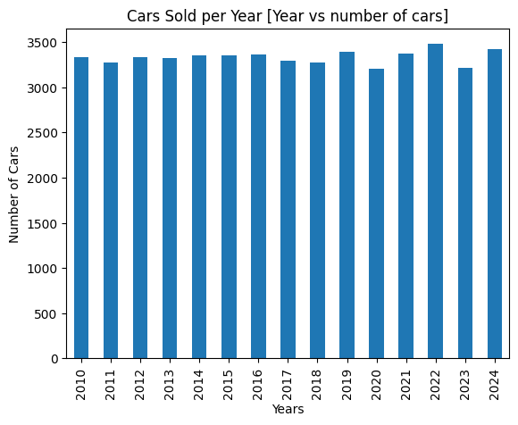
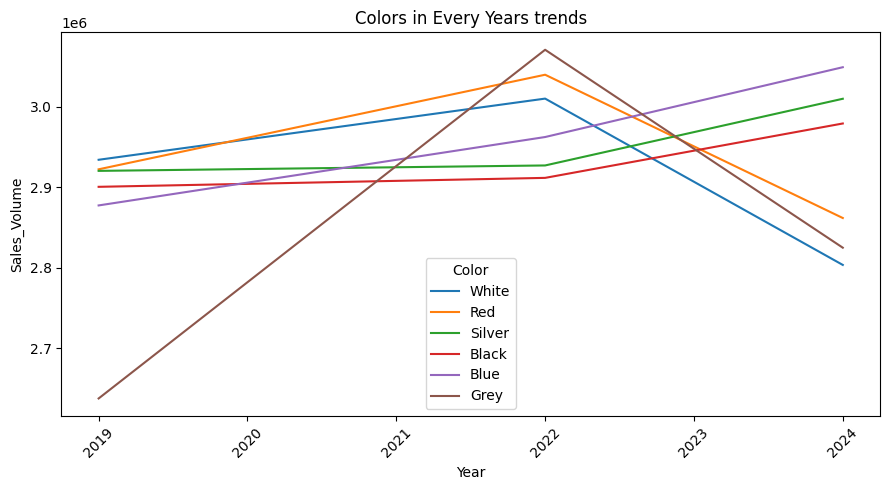
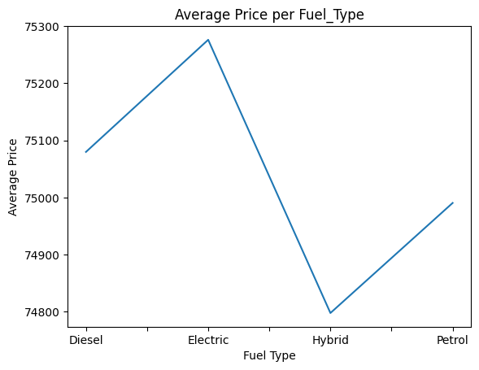
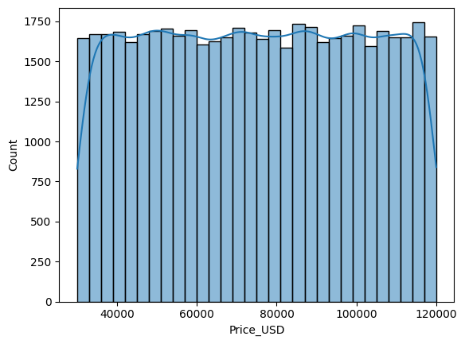
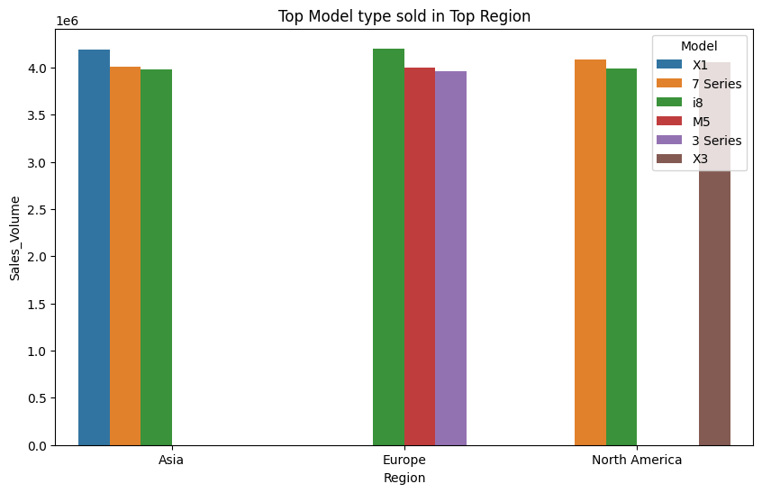
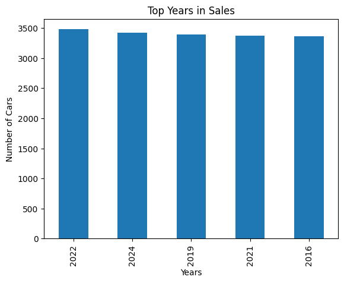

# 🚗 BMW Car Sales Analysis

This project aims to Analyze BMW car sales based on various features like car model, year, price, and fuel type. Using Python we perform data cleaning, exploratory analysis, and deriving insights to uncover patterns and help management to make decisions.

## 📁 Dataset

- **File:** `BMW_Car_Sales_Classification.csv`
- **Records:** Multiple BMW car listings
- **Features Include:**
  - `Model`
  - `Price`
  - `Year`
  - `Fuel Type`
  - `Transmission`
  - `Mileage`
  - `Tax`
  - `MPG`
  - `EngineSize`
  - Target: **Sales Category** (High/Low)

---

## 🔍 Problem Statement

**Objective:**  
Classify whether a BMW car sale is likely to be high or low based on its specifications and features using a supervised learning approach.

---

## 🔧 Technologies Used

- Python 🐍
- Pandas & NumPy
- Matplotlib & Seaborn
- Plotly Express (interactive visualizations)
- Scikit-learn (modeling and evaluation)
- Jupyter Notebook

---

## 🧼 Data Cleaning Steps

- Checking duplicate rows, blank andwhite spaces.
- checking data integrity
- Handled missing or irrelevant columns
- Engineered new columns if required

---

## 📊 Exploratory Data Analysis

- Distribution of sales across different models and fuel types
- Churn rate (or sales success rate) grouped by tenure or car features
- Interactive bar plots with Plotly to explore key variables

**Example:**  
 ← 
 ← 
 ← 
 ← 
 ← 
 ←
 ← 

---

---

## 📌 How to Run

1. Clone this repo or download the files
2. Open `BMWCARS.ipynb` in Jupyter Notebook
3. Run all cells to reproduce analysis and results

---

## 📈 Future Work

- ## 🤖 Classification Model
- ## Metrics Evaluaation
  - Accuracy Score
  - Confusion Matrix
  - Feature Importance

---

## 🙌 Author

- **Nikhil Chavan**  
  [GitHub Profile]([https://github.com/Niks23c](https://github.com/Niks23c))

---

## ⭐️ Show Your Support

If you found this project useful, leave a ⭐️ on the [repository](https://github.com/Niks23c/bmw-car-sales)!

